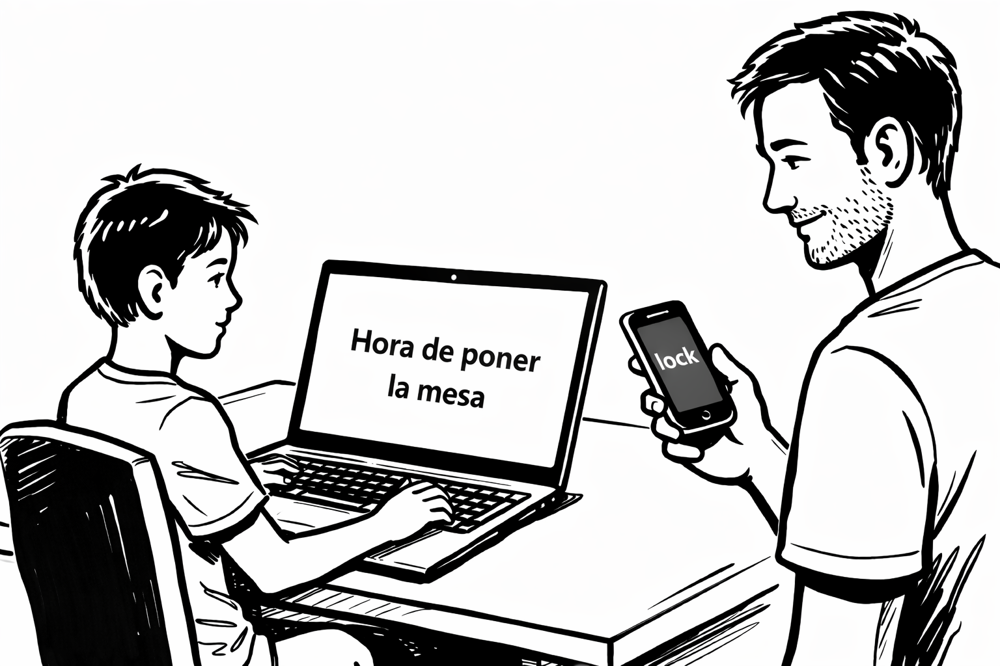

# ScreenLocker – Instalador (Beta)

ScreenLocker es una pequeña aplicación para **bloquear un ordenador Windows**
y mostrar un **mensaje en pantalla**, pensada para su uso en entornos familiares.

Está pensada para esos momentos en los que se acaba el tiempo de ordenador
y empieza la típica negociación del *“cinco minutos más”*.

Con ScreenLocker, el adulto decide cuándo termina el uso del PC
y en la pantalla aparece un mensaje claro, por ejemplo
*“Hora de poner la mesa”* o *“Se acabó el ordenador”*. El objetivo no es castigar ni prohibir, sino facilitar el momento de parar cuando al niño le cuesta desconectar del juego.



⚠️ Estado actual: versión Beta / pruebas.

Funciona bien, pero es sencilla y mejorable. El objetivo es probarla y recoger feedback.

## 🤔 ¿Es ScreenLocker para mí?

ScreenLocker puede ser útil si:

- Tu hijo usa el ordenador para jugar o estudiar y **le cuesta parar** cuando se acaba el tiempo
- Quieres **ayudarle a hacer la transición** a otra actividad (cenar, deberes, dormir…)
- Prefieres **un mensaje claro en pantalla** antes que discusiones o recordatorios constantes
- No necesitas un sistema completo de control parental, sino **una ayuda puntual para el momento de parar**

ScreenLocker probablemente **no es para ti** si:

- Buscas un control parental automático con horarios, estadísticas o informes
- Necesitas limitar contenidos, aplicaciones o páginas web
- Prefieres que el propio sistema gestione los tiempos sin intervención manual


## 🧠 ¿Cómo funciona ScreenLocker?

1. El ordenador tiene instalada la aplicación ScreenLocker.
2. El padre/madre accede a una **base de datos online** (Firebase).
3. En esa base de datos:
   - Se indica si el ordenador debe estar **bloqueado (`lock`)** o **desbloqueado (`unlock`)**
   - Se puede cambiar el **mensaje** que verá el niño en pantalla
4. La aplicación consulta esa base de datos y:
   - Bloquea la pantalla
   - Muestra el mensaje configurado

👉 El control se hace **desde cualquier dispositivo** (móvil, tablet, otro ordenador).


## 🧭 Flujo de uso (importante)

Antes de instalar ScreenLocker es necesario **configurar una base de datos online**.
El orden correcto es:

1. Configurar la base de datos (Firebase)
2. Instalar ScreenLocker en el ordenador
3. Usar la base de datos para bloquear / desbloquear el equipo


## 1️⃣ Configuración de la base de datos

ScreenLocker utiliza una **base de datos online (Firebase Realtime Database)**
desde la que se controla el bloqueo del ordenador.

Este video explica cómo crear la base de datos:
<a href="https://youtu.be/KFYa1E_6j00?si=JoEpb40r53uDv_Wt" target="_blank" rel="noopener noreferrer">
🎥 Video paso a paso de cómo crear y configurar la base de datos
</a>


La base de datos se define con un **JSON** como el siguiente:

<a href="https://jsoneditoronline.org/?json=%7B%22pc_alejandro%22%3A%7B%22command%22%3A%22unlock%22%2C%22message%22%3A%22Hora%20de%20ayudar%20a%20poner%20la%20mesa%22%7D%7D" target="_blank" rel="noopener noreferrer">
👉 Abrir editor online con el JSON precargado
</a>


```json
{
  "pc_alejandro": {
    "command": "unlock",
    "message": "Hora de ayudar a poner la mesa"
  }
}
```

Este JSON define:
- **pc_alejandro** → identificador del dispositivo
- **command** → acción a ejecutar (usa "lock" para bloquear y "unlock" para desbloquear)
- **message** → mensaje mostrado al usuario


## 2️⃣ Instalación de ScreenLocker (Windows)

Una vez configurada la base de datos, puedes instalar ScreenLocker en el ordenador que quieras controlar.

<a href="https://github.com/danielir/screenLocker-installer/releases/download/beta/Setup.msi">⬇️ Descargar ScreenLocker (Windows)</a>


Importante:
- Tras instalar la aplicación es necesario **reiniciar el ordenador una vez**.
- El ordenador debe estar **conectado a Internet**.
- El bloqueo/desbloqueo es **manual**: hay que cambiar el valor `lock / unlock` en la base de datos.

